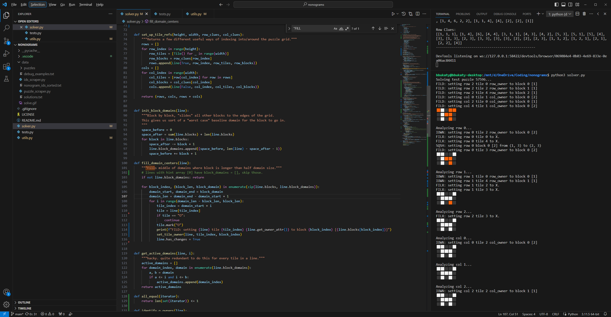
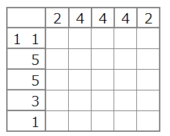
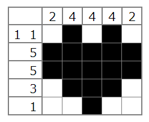
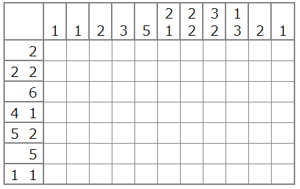
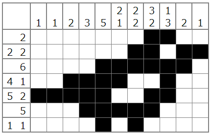

# nonograms
A nonogram puzzle solver in Python 3.

# About
I was introduced to nonogram puzzles recently, and they reminded me of the kinds of problems you encounter on algorithm practice sites. 

It seemed like it would be fun to build a nonogram solver from scratch, so I intentionally didn't look up any existing approaches and dove into the problem. In the process, I also ended up building a web scraper for a large online nonogram puzzle database to test my algorithm against.[^1]

I ended up with a pretty competent solver that only got stuck on inferences that weren't obvious to me as a human (though I'm definitely a nonogram novice). **It solved 87% of the ~4000 puzzles I scraped**.[^2]

At the bottom of this readme, you can see some examples of puzzles it successfully solved and didn't solve.  

Additionally, [notes/solutions.gif](notes/solutions.gif) (_warning: flashing imagery_) shows the command line output of the solver running on all my test puzzles. It was fun to see my solver algorithm cruise through hundreds of puzzles that would each take me a good 20 minutes and a calculator to figure out.

# Approach
In the parlance of the papers I found, I was focusing on "line solving". I analyze rows and columns one at a time with respect to their current state and clues, filling in tiles only with certainty (as opposed to applying search algorithms/guess and check).

To make more progress with this approach, it looked like I was going to need to start adding much more complicated inference rules to solve the long tail of edge cases supported by the puzzle rules. This was a bit surprising to me!

In fact, it turns out that nonograms are actually a pretty tricky NP-complete problem with several [research](https://ir.nctu.edu.tw/bitstream/11536/22772/1/000324586300005.pdf) [papers](https://citeseerx.ist.psu.edu/viewdoc/download?doi=10.1.1.177.76&rep=rep1&type=pdf) dedicated to solver algorithms!

Anyway, might revisit and improve this later, but I had fun working on it.

# Examples

For fun, here's a snapshot of what my workflow looked like while developing and testing the solver:

### Successful Solves
  
 

The rest of my examples are going to use the solution format that my script actually printed, which was emoji grids (don't look at me like that, it was convenient). You'll notice that hints are omitted; I didn't end up making a good way of printing out hint grids in the command line.

⬜⬛⬜⬛⬜  
⬛⬛⬛⬛⬛  
⬛⬛⬛⬛⬛  
⬜⬛⬛⬛⬜  
⬜⬜⬛⬜⬜  

⬛⬛⬛⬜⬜⬜⬜⬜⬜  
⬛⬜⬛⬛⬛⬛⬛⬛⬛  
⬛⬛⬛⬜⬜⬜⬛⬜⬛  

⬜⬜⬜⬜⬛⬛⬜⬜  
⬜⬜⬜⬜⬛⬛⬛⬜  
⬜⬜⬜⬜⬛⬜⬜⬛  
⬜⬜⬜⬜⬛⬜⬜⬜  
⬜⬜⬜⬜⬛⬜⬜⬜  
⬜⬛⬛⬛⬛⬜⬜⬜  
⬛⬛⬛⬛⬛⬜⬜⬜  
⬛⬛⬛⬛⬛⬜⬜⬜  
⬜⬛⬛⬛⬜⬜⬜⬜  

⬛⬛⬛⬛⬛⬛⬛⬛⬛⬛⬛⬛⬛⬛⬛⬛⬜⬜  
⬛⬜⬜⬛⬛⬛⬛⬛⬜⬜⬜⬜⬛⬜⬜⬛⬛⬜  
⬛⬜⬜⬛⬛⬛⬛⬛⬜⬜⬜⬜⬛⬜⬜⬜⬛⬛  
⬛⬜⬜⬛⬛⬛⬛⬛⬜⬜⬜⬜⬛⬜⬜⬜⬜⬛  
⬛⬜⬜⬛⬛⬛⬛⬛⬛⬛⬛⬛⬛⬜⬜⬜⬜⬛  
⬛⬜⬜⬜⬜⬜⬜⬜⬜⬜⬜⬜⬜⬜⬜⬜⬜⬛  
⬛⬜⬜⬜⬜⬜⬜⬜⬜⬜⬜⬜⬜⬜⬜⬜⬜⬛  
⬛⬜⬜⬜⬜⬜⬜⬜⬜⬜⬜⬜⬜⬜⬜⬜⬜⬛  
⬛⬜⬜⬜⬜⬜⬜⬜⬜⬜⬜⬜⬜⬜⬜⬜⬜⬛  
⬛⬜⬜⬛⬛⬛⬛⬛⬛⬛⬛⬛⬛⬛⬛⬜⬜⬛  
⬛⬜⬜⬛⬜⬜⬜⬜⬜⬜⬜⬜⬜⬜⬛⬜⬜⬛  
⬛⬜⬜⬛⬜⬛⬛⬛⬛⬛⬛⬛⬛⬜⬛⬜⬜⬛  
⬛⬜⬜⬛⬜⬛⬛⬛⬛⬛⬛⬛⬛⬜⬛⬜⬜⬛  
⬛⬜⬜⬛⬜⬜⬜⬜⬜⬜⬜⬜⬜⬜⬛⬜⬜⬛  
⬛⬜⬜⬛⬜⬜⬜⬜⬜⬜⬜⬜⬜⬜⬛⬜⬜⬛  
⬛⬜⬜⬛⬜⬜⬜⬜⬜⬜⬜⬜⬜⬜⬛⬜⬜⬛  
⬛⬜⬜⬛⬜⬜⬜⬜⬜⬜⬜⬜⬜⬜⬛⬜⬜⬛  
⬛⬛⬛⬛⬛⬛⬛⬛⬛⬛⬛⬛⬛⬛⬛⬛⬛⬛  

⬜⬜⬜⬜⬜⬜⬜⬜⬛⬜⬜⬜⬜⬜⬜⬜⬜⬜⬜⬜  
⬜⬜⬜⬜⬜⬜⬜⬛⬛⬜⬜⬜⬜⬜⬜⬜⬜⬜⬜⬜  
⬜⬜⬜⬜⬜⬜⬛⬛⬛⬜⬜⬜⬜⬜⬜⬜⬜⬜⬜⬜  
⬜⬜⬜⬜⬛⬛⬛⬛⬛⬛⬛⬛⬜⬜⬜⬜⬜⬜⬜⬜  
⬜⬜⬜⬛⬛⬛⬛⬛⬛⬛⬛⬛⬛⬜⬜⬜⬜⬜⬜⬜  
⬜⬜⬜⬛⬛⬛⬛⬛⬛⬛⬛⬛⬛⬛⬜⬜⬜⬜⬜⬜  
⬜⬜⬛⬛⬛⬛⬛⬛⬛⬛⬛⬛⬛⬛⬛⬜⬜⬜⬜⬜  
⬜⬜⬛⬛⬛⬛⬛⬛⬛⬛⬛⬛⬛⬛⬛⬜⬜⬜⬜⬜  
⬜⬜⬛⬛⬜⬛⬛⬜⬜⬜⬜⬛⬛⬛⬛⬜⬜⬜⬜⬜  
⬜⬜⬛⬛⬛⬛⬜⬜⬜⬜⬜⬜⬜⬛⬛⬛⬜⬜⬜⬜  
⬜⬜⬜⬛⬛⬜⬜⬜⬜⬜⬜⬜⬜⬜⬛⬛⬛⬛⬛⬜  
⬜⬜⬜⬜⬛⬜⬜⬜⬜⬜⬜⬜⬜⬛⬛⬜⬛⬛⬜⬜  
⬜⬜⬜⬜⬛⬜⬜⬜⬜⬜⬜⬜⬜⬛⬛⬜⬜⬜⬜⬜  
⬜⬜⬜⬜⬜⬜⬜⬜⬜⬜⬜⬜⬜⬛⬜⬜⬜⬜⬜⬜  
⬜⬛⬛⬛⬜⬜⬜⬜⬜⬛⬛⬛⬜⬜⬜⬜⬜⬛⬛⬛  
⬛⬛⬛⬛⬛⬜⬜⬜⬛⬛⬛⬛⬛⬜⬜⬜⬛⬛⬛⬛  
⬜⬜⬜⬛⬛⬛⬛⬛⬜⬜⬜⬛⬛⬛⬛⬛⬜⬜⬜⬛  
⬛⬛⬛⬜⬛⬛⬛⬜⬛⬛⬛⬜⬛⬛⬛⬜⬛⬛⬛⬜  
⬛⬛⬛⬛⬜⬜⬜⬛⬛⬛⬛⬛⬜⬜⬜⬛⬛⬛⬛⬛  
⬜⬛⬛⬛⬛⬛⬛⬜⬜⬜⬛⬛⬛⬛⬛⬜⬜⬜⬛⬛  

⬜⬜⬛⬜⬜⬜⬜⬜⬜⬜⬜⬜⬜⬜⬜⬜⬜⬜⬜⬜⬜⬜⬜⬜⬜⬜⬜⬜⬜⬜⬜⬜⬜⬜⬜⬜⬜⬜⬜⬜⬜⬜⬜⬜⬜  
⬜⬜⬛⬜⬜⬜⬜⬜⬜⬜⬜⬜⬜⬜⬜⬜⬜⬜⬜⬜⬜⬜⬜⬜⬜⬜⬜⬜⬜⬜⬜⬜⬜⬜⬜⬜⬜⬜⬜⬜⬜⬜⬛⬜⬜  
⬜⬛⬛⬛⬜⬜⬜⬜⬜⬜⬜⬜⬜⬜⬜⬜⬜⬜⬜⬜⬜⬜⬜⬜⬜⬜⬜⬜⬜⬜⬜⬜⬜⬜⬜⬜⬜⬜⬜⬜⬜⬜⬛⬜⬜  
⬜⬛⬛⬛⬜⬜⬜⬜⬜⬜⬜⬜⬜⬜⬜⬜⬜⬜⬜⬜⬜⬜⬜⬜⬜⬜⬜⬜⬜⬜⬜⬜⬜⬜⬜⬜⬜⬜⬜⬜⬜⬛⬛⬛⬜  
⬜⬛⬛⬛⬜⬜⬜⬜⬜⬜⬜⬜⬜⬜⬜⬜⬜⬜⬜⬜⬜⬜⬜⬜⬜⬜⬜⬜⬜⬜⬜⬜⬜⬜⬜⬜⬜⬜⬜⬜⬜⬛⬛⬛⬜  
⬜⬛⬛⬛⬜⬜⬜⬜⬜⬜⬜⬜⬜⬜⬜⬜⬜⬜⬜⬜⬜⬜⬜⬜⬜⬜⬜⬜⬜⬜⬜⬜⬜⬜⬜⬜⬜⬜⬜⬜⬜⬛⬛⬛⬜  
⬛⬛⬛⬛⬛⬜⬜⬜⬜⬜⬜⬜⬜⬜⬜⬜⬜⬜⬜⬜⬜⬜⬜⬜⬜⬜⬜⬜⬜⬜⬜⬜⬜⬜⬜⬜⬜⬜⬜⬜⬛⬛⬛⬛⬛  
⬛⬜⬛⬜⬛⬜⬜⬜⬜⬜⬜⬜⬜⬜⬜⬜⬜⬜⬜⬜⬜⬜⬜⬜⬜⬜⬜⬜⬜⬜⬜⬜⬜⬜⬜⬜⬜⬜⬜⬜⬛⬜⬛⬜⬛  
⬛⬜⬛⬜⬛⬜⬜⬜⬜⬜⬜⬜⬜⬜⬜⬜⬜⬜⬜⬜⬜⬜⬛⬜⬜⬜⬜⬜⬜⬜⬜⬜⬜⬜⬜⬜⬜⬜⬜⬜⬛⬜⬛⬜⬛  
⬛⬜⬛⬜⬛⬜⬜⬜⬜⬜⬜⬜⬜⬜⬜⬜⬜⬜⬜⬜⬜⬛⬛⬛⬜⬜⬜⬜⬜⬜⬜⬜⬜⬜⬜⬜⬜⬜⬜⬜⬛⬜⬛⬜⬛  
⬛⬜⬛⬜⬛⬜⬜⬜⬜⬜⬜⬜⬜⬜⬜⬜⬜⬜⬜⬜⬛⬛⬛⬛⬛⬜⬜⬜⬜⬜⬜⬜⬜⬜⬜⬜⬜⬜⬜⬜⬛⬜⬛⬜⬛  
⬛⬜⬛⬜⬛⬜⬜⬜⬜⬜⬜⬜⬜⬜⬜⬜⬜⬜⬜⬛⬛⬛⬛⬛⬛⬛⬜⬜⬜⬜⬜⬜⬜⬜⬜⬜⬜⬜⬜⬜⬛⬜⬛⬜⬛  
⬛⬜⬛⬜⬛⬜⬜⬜⬜⬜⬜⬜⬜⬜⬜⬜⬜⬛⬛⬛⬛⬛⬛⬛⬛⬛⬛⬛⬜⬜⬜⬜⬜⬜⬜⬜⬜⬜⬜⬜⬛⬜⬛⬜⬛  
⬛⬛⬛⬛⬛⬜⬜⬜⬜⬜⬜⬜⬜⬜⬜⬜⬛⬛⬛⬛⬛⬛⬛⬛⬛⬛⬛⬛⬛⬜⬜⬜⬜⬜⬜⬜⬜⬜⬜⬜⬛⬛⬛⬛⬛  
⬜⬛⬛⬛⬜⬜⬜⬜⬜⬛⬜⬜⬜⬜⬜⬛⬛⬛⬛⬛⬛⬛⬛⬛⬛⬛⬛⬛⬛⬛⬜⬜⬜⬜⬜⬛⬜⬜⬜⬜⬜⬛⬛⬛⬜  
⬜⬛⬛⬛⬜⬜⬜⬜⬛⬛⬛⬜⬜⬜⬛⬛⬛⬛⬛⬛⬛⬛⬛⬛⬛⬛⬛⬛⬛⬛⬛⬜⬜⬜⬛⬛⬛⬜⬜⬜⬜⬛⬛⬛⬜  
⬜⬛⬛⬛⬜⬜⬜⬛⬛⬛⬛⬛⬜⬜⬛⬛⬛⬛⬛⬛⬛⬛⬛⬛⬛⬛⬛⬛⬛⬛⬛⬜⬜⬛⬛⬛⬛⬛⬜⬜⬜⬛⬛⬛⬜  
⬜⬛⬛⬛⬜⬜⬛⬛⬛⬛⬛⬛⬛⬜⬛⬛⬛⬛⬛⬛⬛⬛⬛⬛⬛⬛⬛⬛⬛⬛⬛⬜⬛⬛⬛⬛⬛⬛⬛⬜⬜⬛⬛⬛⬜  
⬜⬛⬛⬛⬜⬛⬛⬛⬛⬛⬛⬛⬛⬛⬜⬛⬛⬛⬛⬛⬛⬛⬛⬛⬛⬛⬛⬛⬛⬛⬜⬛⬛⬛⬛⬛⬛⬛⬛⬛⬜⬛⬛⬛⬜  
⬜⬛⬛⬛⬜⬛⬛⬛⬛⬛⬛⬛⬛⬛⬜⬜⬛⬛⬛⬛⬛⬛⬛⬛⬛⬛⬛⬛⬛⬜⬜⬛⬛⬛⬛⬛⬛⬛⬛⬛⬜⬛⬛⬛⬜  
⬜⬛⬛⬛⬜⬜⬛⬛⬛⬛⬛⬛⬛⬜⬜⬜⬜⬛⬛⬜⬜⬜⬛⬜⬜⬜⬛⬛⬜⬜⬜⬜⬛⬛⬛⬛⬛⬛⬛⬜⬜⬛⬛⬛⬜  
⬛⬛⬛⬛⬛⬜⬛⬜⬜⬜⬜⬜⬛⬜⬜⬛⬛⬛⬛⬜⬜⬜⬛⬜⬜⬜⬛⬛⬛⬛⬜⬜⬛⬜⬜⬜⬜⬜⬛⬜⬛⬛⬛⬛⬛  
⬛⬛⬛⬛⬛⬛⬛⬛⬛⬛⬛⬛⬛⬛⬛⬛⬛⬛⬛⬛⬛⬛⬛⬛⬛⬛⬛⬛⬛⬛⬛⬛⬛⬛⬛⬛⬛⬛⬛⬛⬛⬛⬛⬛⬛  
⬛⬛⬛⬛⬛⬛⬛⬛⬛⬛⬛⬛⬛⬛⬛⬛⬛⬛⬛⬛⬜⬜⬜⬜⬜⬛⬛⬛⬛⬛⬛⬛⬛⬛⬛⬛⬛⬛⬛⬛⬛⬛⬛⬛⬛  
⬛⬛⬛⬛⬛⬛⬛⬛⬛⬛⬛⬛⬛⬛⬛⬛⬛⬛⬜⬜⬜⬜⬜⬜⬜⬜⬜⬛⬛⬛⬛⬛⬛⬛⬛⬛⬛⬛⬛⬛⬛⬛⬛⬛⬛  
⬛⬛⬛⬛⬛⬛⬛⬛⬛⬛⬛⬛⬛⬛⬛⬛⬜⬜⬜⬜⬜⬛⬛⬛⬜⬜⬜⬜⬜⬛⬛⬛⬛⬛⬛⬛⬛⬛⬛⬛⬛⬛⬛⬛⬛  
⬛⬛⬛⬛⬛⬛⬛⬛⬛⬛⬛⬛⬛⬛⬛⬛⬜⬜⬛⬜⬜⬛⬛⬛⬜⬜⬛⬜⬜⬛⬛⬛⬛⬛⬛⬛⬛⬛⬛⬛⬛⬛⬛⬛⬛  
⬛⬛⬛⬛⬛⬛⬛⬛⬛⬛⬛⬛⬛⬛⬛⬛⬜⬛⬛⬜⬜⬛⬛⬛⬜⬜⬛⬛⬜⬛⬛⬛⬛⬛⬛⬛⬛⬛⬛⬛⬛⬛⬛⬛⬛  
⬛⬛⬛⬛⬛⬜⬜⬛⬜⬜⬛⬛⬜⬜⬛⬛⬜⬛⬛⬜⬛⬛⬛⬛⬛⬜⬛⬛⬜⬛⬛⬜⬜⬛⬛⬜⬜⬛⬜⬜⬛⬛⬛⬛⬛  
⬛⬛⬛⬛⬜⬜⬜⬛⬜⬜⬜⬛⬜⬜⬛⬛⬜⬜⬜⬜⬛⬛⬛⬛⬛⬜⬜⬜⬜⬛⬛⬜⬜⬛⬜⬜⬜⬛⬜⬜⬜⬛⬛⬛⬛  
⬛⬛⬛⬛⬜⬜⬜⬛⬜⬜⬜⬛⬜⬜⬛⬛⬜⬜⬜⬜⬛⬛⬛⬛⬛⬜⬜⬜⬜⬛⬛⬜⬜⬛⬜⬜⬜⬛⬜⬜⬜⬛⬛⬛⬛  
⬛⬛⬛⬛⬜⬜⬜⬛⬜⬜⬜⬛⬜⬜⬛⬛⬜⬜⬜⬜⬛⬛⬛⬛⬛⬜⬜⬜⬜⬛⬛⬜⬜⬛⬜⬜⬜⬛⬜⬜⬜⬛⬛⬛⬛  
⬛⬛⬛⬛⬛⬛⬛⬛⬛⬛⬛⬛⬛⬛⬛⬛⬜⬜⬜⬜⬛⬛⬛⬛⬛⬜⬜⬜⬜⬛⬛⬛⬛⬛⬛⬛⬛⬛⬛⬛⬛⬛⬛⬛⬛  

### Unsucessful Solves

Orange squares represent the remaining unsolved portions of a puzzle.

🟧🟧⬜⬜🟧⬜⬜🟧🟧🟧🟧  
🟧🟧⬜⬜🟧🟧🟧⬛🟧🟧🟧  
⬜⬜⬜🟧⬛⬛⬛⬛⬛🟧⬜  
⬜🟧⬛⬛⬛🟧🟧🟧🟧🟧🟧  
🟧🟧⬛⬛⬛🟧🟧🟧⬛🟧⬜  
⬜⬜⬜🟧🟧🟧⬛⬛🟧🟧🟧  
🟧🟧⬜⬜🟧🟧🟧🟧🟧🟧🟧  

Correct solution to above puzzle:

⬜🟧⬛⬛⬛🟧⬜⬜⬜⬜⬛⬛⬛⬜⬜  
⬜⬛⬛⬛⬛⬛⬜⬜⬜⬛⬛⬛⬛⬛⬜  
⬛⬛⬛⬛⬛⬛⬛⬜⬛⬛⬛⬛⬛⬛⬛  
⬛⬛⬛⬛⬛⬛⬛⬛⬛⬛⬛⬛⬛⬛⬛  
⬜🟧⬛⬛⬛🟧⬜⬜⬜⬜⬛⬛⬛⬛⬜  
🟧🟧⬜⬛⬜🟧🟧🟧🟧🟧⬜⬛⬜⬜🟧  
🟧🟧🟧⬛🟧🟧🟧🟧🟧🟧🟧⬛🟧🟧🟧  
🟧🟧🟧⬛🟧🟧🟧🟧🟧🟧🟧⬛🟧🟧🟧  
🟧🟧🟧⬛🟧🟧🟧🟧🟧🟧🟧⬛🟧🟧🟧  
🟧🟧🟧⬜🟧🟧⬛⬛⬛🟧🟧⬜🟧🟧🟧  
🟧🟧🟧🟧🟧🟧🟧🟧🟧🟧🟧🟧🟧🟧🟧  
🟧🟧🟧🟧🟧🟧🟧🟧🟧🟧🟧🟧🟧🟧🟧  
🟧🟧🟧🟧🟧🟧🟧🟧🟧🟧🟧🟧🟧🟧🟧  
🟧🟧🟧🟧🟧🟧🟧🟧🟧🟧🟧🟧🟧🟧🟧  
🟧🟧🟧🟧🟧🟧🟧🟧🟧🟧🟧🟧🟧🟧🟧  
🟧🟧🟧🟧🟧🟧🟧🟧🟧🟧🟧🟧🟧🟧🟧  
🟧🟧🟧🟧🟧🟧🟧🟧🟧🟧🟧🟧🟧🟧🟧  
🟧🟧🟧🟧🟧🟧🟧🟧🟧🟧🟧🟧🟧🟧🟧  
🟧🟧🟧🟧🟧🟧🟧🟧🟧🟧🟧🟧🟧🟧🟧  
🟧🟧🟧🟧🟧🟧🟧🟧🟧🟧🟧🟧🟧🟧🟧  
🟧🟧🟧🟧⬛🟧🟧🟧🟧🟧⬛🟧🟧🟧🟧  
🟧🟧⬜🟧⬛🟧🟧🟧🟧🟧⬛🟧⬜🟧🟧  
🟧🟧⬛🟧⬛🟧🟧🟧🟧🟧⬛🟧⬛🟧🟧  
🟧🟧⬛⬛⬛🟧🟧🟧🟧🟧⬛⬛⬛🟧🟧  
🟧🟧⬛🟧🟧🟧🟧🟧🟧🟧🟧🟧⬛🟧🟧  

⬜⬜⬜⬜⬜⬜⬜⬜⬜⬜⬜⬜⬜⬜⬜⬜⬜⬜⬜⬜⬜⬛⬛⬛⬜⬜⬜⬜⬜⬜⬜⬜⬜⬜⬜⬜⬜⬜⬜⬜⬜⬜⬜⬜⬜  
⬜⬜🟧🟧🟧🟧🟧🟧⬜⬜⬜🟧⬜🟧⬜🟧🟧⬛🟧🟧⬛⬜⬜⬜⬛🟧🟧⬛🟧🟧⬜🟧⬜🟧⬜⬜⬜🟧🟧🟧🟧🟧🟧⬜⬜  
⬜⬜🟧🟧🟧🟧🟧🟧⬜⬜⬜🟧⬜🟧⬜🟧⬛⬜🟧⬛⬛⬛⬜⬛⬛⬛🟧⬜⬛🟧⬜🟧⬜🟧⬜⬜⬜🟧🟧🟧🟧🟧🟧⬜⬜  
⬜⬜🟧🟧🟧🟧🟧🟧⬜⬜⬜🟧⬜🟧⬜🟧⬛⬛🟧🟧⬛⬛⬜⬛⬛🟧🟧⬛⬛🟧⬜🟧⬜🟧⬜⬜⬜🟧🟧🟧🟧🟧🟧⬜⬜  
⬜⬜🟧🟧🟧🟧🟧🟧⬜⬜⬜🟧⬜🟧⬜🟧⬛⬛🟧⬜⬛⬜⬜⬜⬛⬜🟧⬛⬛🟧⬜🟧⬜🟧⬜⬜⬜🟧🟧🟧🟧🟧🟧⬜⬜  
⬜⬜🟧🟧🟧🟧🟧🟧⬜⬜⬜🟧⬜🟧⬜🟧🟧⬜⬜⬛⬛⬛⬛⬛⬛⬛⬜⬜🟧🟧⬜🟧⬜🟧⬜⬜⬜🟧🟧🟧🟧🟧🟧⬜⬜  
⬜⬜⬜⬜⬜⬜⬜⬜⬜⬜⬜⬜⬜⬜⬜⬜⬜⬛⬛⬛⬛⬛⬛⬛⬛⬛⬛⬛⬜⬜⬜⬜⬜⬜⬜⬜⬜⬜⬜⬜⬜⬜⬜⬜⬜  
⬜⬜⬜⬜⬜⬜⬜⬜⬜⬜⬜⬜⬜⬜⬜⬜⬜⬜⬜⬜⬜⬜⬜⬜⬜⬜⬜⬜⬜⬜⬜⬜⬜⬜⬜⬜⬜⬜⬜⬜⬜⬜⬜⬜⬜  
⬜⬜⬜⬜⬜⬜⬜⬜⬛⬛⬛⬛⬛⬛⬛⬛⬛⬛⬛⬛⬛⬛⬛⬛⬛⬛⬛⬛⬛⬛⬛⬛⬛⬛⬛⬛⬛⬜⬜⬜⬜⬜⬜⬜⬜  
⬜⬜⬜⬜⬜⬜🟧🟧⬛⬛⬛⬛⬛⬛⬛⬛⬛⬛⬛⬛⬛⬛⬛⬛⬛⬛⬛⬛⬛⬛⬛⬛⬛⬛⬛⬛⬛🟧🟧⬜⬜⬜⬜⬜⬜  
⬜⬜🟧🟧🟧🟧🟧🟧⬛⬛⬛⬛⬛⬛⬛⬛⬛⬛⬛⬛⬛⬛⬛⬛⬛⬛⬛⬛⬛⬛⬛⬛⬛⬛⬛⬛⬛🟧🟧🟧🟧🟧🟧⬜⬜  
⬜⬜⬜⬜⬜⬜⬜⬜⬜⬜⬜⬜⬜⬜⬜⬜⬜⬜⬜⬜⬜⬜⬜⬜⬜⬜⬜⬜⬜⬜⬜⬜⬜⬜⬜⬜⬜⬜⬜⬜⬜⬜⬜⬜⬜  
⬜⬜⬛⬛⬛⬛⬛⬛⬛⬛⬛⬛⬛⬛⬛⬛⬛⬛⬛⬛⬛⬛⬛⬛⬛⬛⬛⬛⬛⬛⬛⬛⬛⬛⬛⬛⬛⬛⬛⬛⬛⬛⬛⬜⬜  
⬜⬛⬛⬛⬛⬛⬛⬛⬛⬛⬛⬛⬛⬛⬛⬛⬛⬛⬛⬛⬛⬛⬛⬛⬛⬛⬛⬛⬛⬛⬛⬛⬛⬛⬛⬛⬛⬛⬛⬛⬛⬛⬛⬛⬜  
⬛⬛⬛⬜⬛⬛⬛⬛⬛⬛⬛⬛⬜⬛⬛⬛⬛⬛⬛⬛⬛⬛⬜⬛⬛⬛⬛⬛⬛⬛⬛⬛⬜⬛⬛⬛⬛⬛⬛⬛⬛⬜⬛⬛⬛  
⬛⬛⬜⬜⬜⬛⬛⬛⬛⬛⬛⬜⬜⬜⬛⬛⬛⬛⬛⬛⬛⬜⬜⬜⬛⬛⬛⬛⬛⬛⬛⬜⬜⬜⬛⬛⬛⬛⬛⬛⬜⬜⬜⬛⬛  
⬛⬛⬜⬜⬜⬛⬛⬛⬛⬛⬛⬜⬜⬜⬛⬛⬛⬛⬛⬛⬛⬜⬜⬜⬛⬛⬛⬛⬛⬛⬛⬜⬜⬜⬛⬛⬛⬛⬛⬛⬜⬜⬜⬛⬛  
⬛⬛⬜⬜⬜⬛⬛⬛⬛⬛⬛⬜⬜⬜⬛⬛⬛⬛⬛⬛⬛⬜⬜⬜⬛⬛⬛⬛⬛⬛⬛⬜⬜⬜⬛⬛⬛⬛⬛⬛⬜⬜⬜⬛⬛  
⬛⬛⬜⬜⬜⬛⬛⬛⬛⬛⬛⬜⬜⬜⬛⬛⬛⬛⬛⬛⬛⬜⬜⬜⬛⬛⬛⬛⬛⬛⬛⬜⬜⬜⬛⬛⬛⬛⬛⬛⬜⬜⬜⬛⬛  
⬛⬛⬛⬜⬛⬛⬛⬛⬛⬛⬛⬛⬜⬛⬛⬛⬛⬛⬛⬛⬛⬛⬜⬛⬛⬛⬛⬛⬛⬛⬛⬛⬜⬛⬛⬛⬛⬛⬛⬛⬛⬜⬛⬛⬛  
⬜⬛⬛⬛⬛⬛⬛⬛⬛⬛⬛⬛⬛⬛⬛⬛⬛⬛⬛⬛⬛⬛⬛⬛⬛⬛⬛⬛⬛⬛⬛⬛⬛⬛⬛⬛⬛⬛⬛⬛⬛⬛⬛⬛⬜  
⬜⬜⬛⬛⬛⬛⬛⬛⬛⬛⬛⬛⬛⬛⬛⬛⬛⬛⬛⬛⬛⬛⬛⬛⬛⬛⬛⬛⬛⬛⬛⬛⬛⬛⬛⬛⬛⬛⬛⬛⬛⬛⬛⬜⬜  
⬜⬜⬜⬜⬜⬜⬜⬜⬜⬜⬜⬜⬜⬜⬜⬜⬜⬜⬜⬜⬜⬜⬜⬜⬜⬜⬜⬜⬜⬜⬜⬜⬜⬜⬜⬜⬜⬜⬜⬜⬜⬜⬜⬜⬜  
⬜⬜⬜⬜⬜⬜⬛⬛⬛⬛⬛⬛⬛⬛⬛⬛⬛⬛⬛⬛⬛⬛⬛⬛⬛⬛⬛⬛⬛⬛⬛⬛⬛⬛⬛⬛⬛⬛⬛⬜⬜⬜⬜⬜⬜  
⬜⬜⬜⬜⬜⬜⬜⬛⬛⬛⬛⬛⬛⬛⬛⬛⬛⬛⬛⬛⬛⬛⬛⬛⬛⬛⬛⬛⬛⬛⬛⬛⬛⬛⬛⬛⬛⬛⬜⬜⬜⬜⬜⬜⬜  
⬜⬜⬜⬜⬜⬜⬜⬜⬛⬛⬛⬛⬛⬛⬛⬛⬛⬛⬛⬛⬛⬛⬛⬛⬛⬛⬛⬛⬛⬛⬛⬛⬛⬛⬛⬛⬛⬜⬜⬜⬜⬜⬜⬜⬜  
⬜⬜🟧🟧🟧⬜⬜⬜⬜⬜⬜🟧⬜🟧⬛⬛⬜⬜⬜⬜⬜⬛⬛⬛⬜⬜⬜⬜⬜⬛⬛🟧⬜🟧⬜⬜⬜⬜⬜⬜🟧🟧🟧⬜⬜  
⬜⬜🟧🟧🟧⬜⬜⬜⬜⬜🟧🟧🟧⬛⬛⬜⬜⬜⬜⬜⬜⬛⬛⬛⬜⬜⬜⬜⬜⬜⬛⬛🟧🟧🟧⬜⬜⬜⬜⬜🟧🟧🟧⬜⬜  
⬜⬜🟧🟧🟧⬜⬜⬜⬜⬜🟧🟧⬛⬛⬛⬜⬜⬜⬜⬜⬜⬛⬛⬛⬜⬜⬜⬜⬜⬜⬛⬛⬛🟧🟧⬜⬜⬜⬜⬜🟧🟧🟧⬜⬜  
⬜⬜🟧🟧🟧⬜⬜⬜⬜⬜🟧🟧⬛⬛⬜⬜⬜⬜⬜⬜⬜⬛⬛⬛⬜⬜⬜⬜⬜⬜⬜⬛⬛🟧🟧⬜⬜⬜⬜⬜🟧🟧🟧⬜⬜  
⬜⬜🟧🟧🟧⬜⬜⬜⬜⬜🟧🟧⬛🟧⬜⬜⬜⬜⬜⬜⬜⬜⬛⬜⬜⬜⬜⬜⬜⬜⬜🟧⬛🟧🟧⬜⬜⬜⬜⬜🟧🟧🟧⬜⬜  
⬜⬜🟧🟧🟧⬜⬜⬜⬜⬜🟧🟧🟧🟧⬜⬜⬜⬜⬜⬜⬜🟧⬛🟧⬜⬜⬜⬜⬜⬜⬜🟧🟧🟧🟧⬜⬜⬜⬜⬜🟧🟧🟧⬜⬜  
⬜⬜🟧🟧🟧⬜⬜⬜⬜⬜🟧🟧🟧🟧⬜⬜⬜⬜⬜⬜⬜🟧⬛🟧⬜⬜⬜⬜⬜⬜⬜🟧🟧🟧🟧⬜⬜⬜⬜⬜🟧🟧🟧⬜⬜  
⬜⬜🟧🟧🟧⬜⬜⬜⬜⬜🟧🟧🟧🟧⬜⬜⬜⬜⬜⬜⬜🟧⬛🟧⬜⬜⬜⬜⬜⬜⬜🟧🟧🟧🟧⬜⬜⬜⬜⬜🟧🟧🟧⬜⬜  

[^1]: I'm not going to name the database or provide my scraper code to avoid any attribution issues.

[^2]: Full disclosure, I actually didn't check that my solutions were _correct_, I only checked that they were _complete_ with no unmarked tiles. I was planning on using an existing solver to fully verify my solutions, but in practice I never observed my solver to mis-mark a tile, so I think that 87% is still a reasonable proxy for correct solutions.